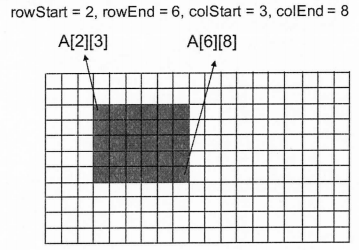

# COMP 1020 Workshop

This repository contains the material for the COMP 1020 workshop.

To run any of the sample programs:
```
javac <filename>.java
java <filename>
```

For example, to run the `MultiDimArrays` program you can use the following commands:
```
javac MultiDimArrays.java
java MultiDimArray
```

## MultiDimArrays.java
Adapted from the [APS105 - Computer Fundamentals Winter 2017 Final Exam](http://courses.skule.ca/course/APS105H1).

Write a function that sets a rectangular portion of a 2-dimensional array to a specific value.
The function takes the following as input parameters: a 2-dimensional interger array, four integer parameters
`rowStart`, `rowEnd`, `colStart`, and `colEnd`, and an integer parameter `value`.

This function should set the specified rectangular portion of the matrix to be the value `value`. Below is an example:
    

Furthermore, the function should check if the input parameters are valid. If so, the function should return `true`. Otherwise, it should return `false` and should not set any values of the array.

## LinkedLists.java
Adapted from the [APS105 - Computer Fundamentals Fall 2015 Final Exam](http://courses.skule.ca/course/APS105H1).

Assume that your linked list is in sorted order. Write a method in the `LinkedList` class called `simplify()` which deletes any duplicate items in the list. For example, if your list originally contained:
```
13 13 15 15 17 17 17 19 22 25 28,
```

then after calling `simplify()`, it should contain:
```
13 15 17 19 22 25 28
```

